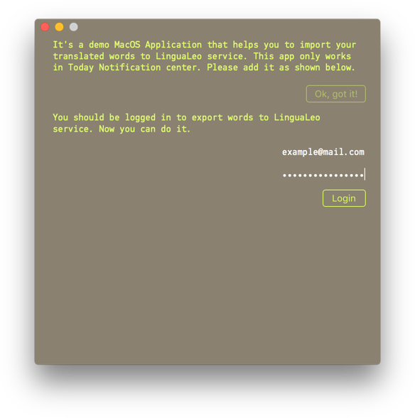
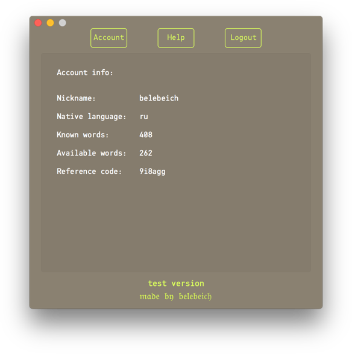
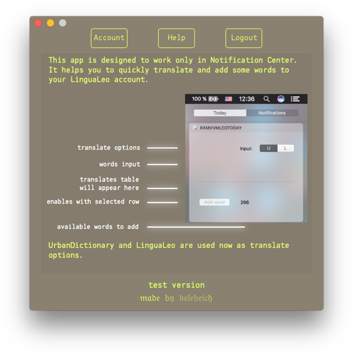

  
  
  

# rxMVVMLeo

rxMVVMLeo is a macOS app. It helps you to add words and translates to LinguaLeo service. This app is designed to work only in Notification Center.  It is build with RxSwift, MVVM, Alamofire and Coordinators.

  

# Development

To start development just git clone this project and install cocoapods

`$ pod install`
